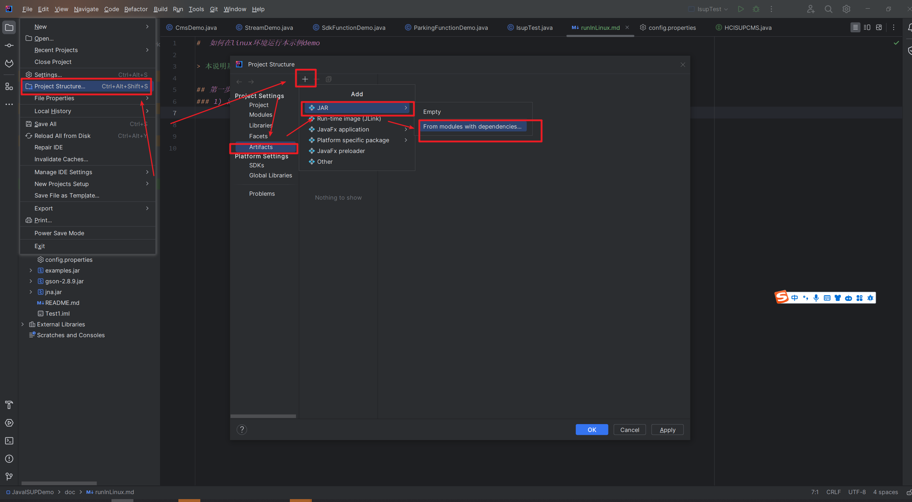
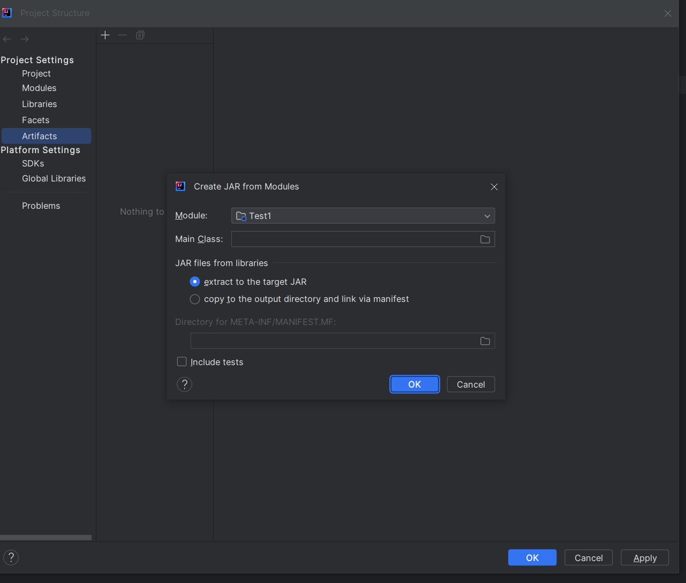
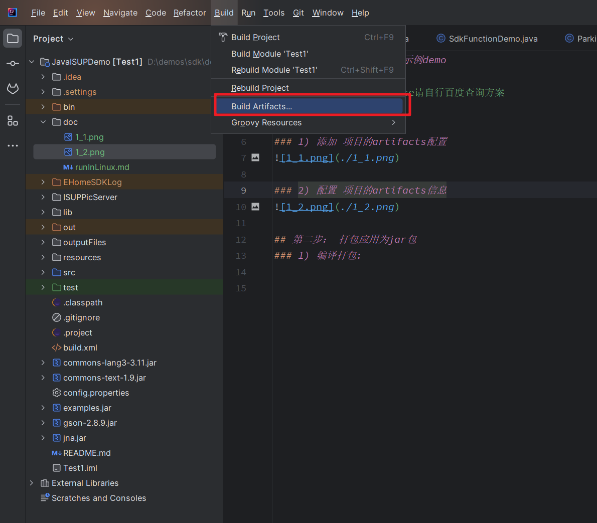
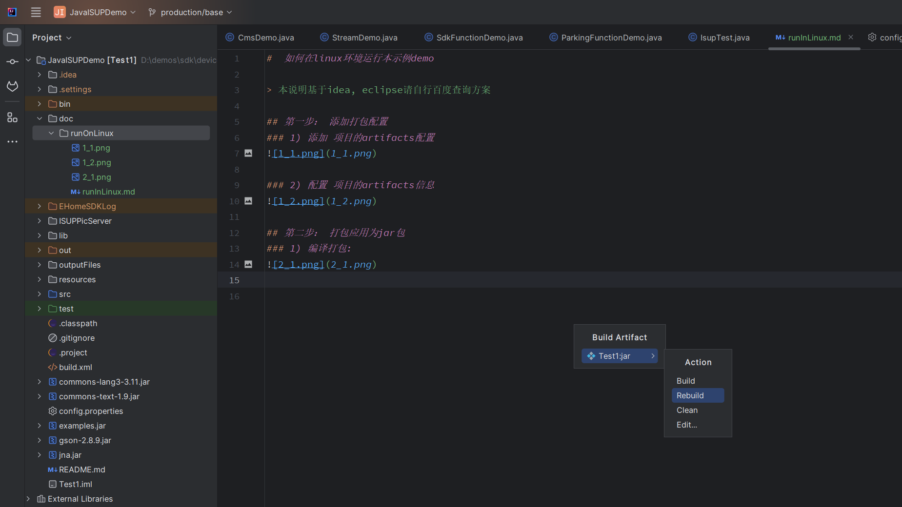
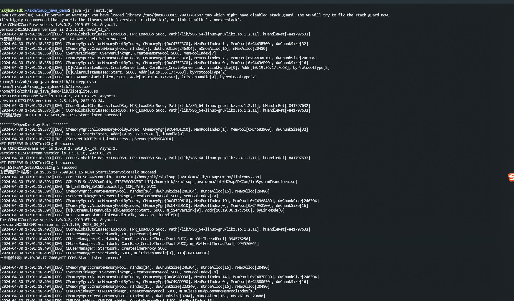

#  如何在linux环境运行本示例demo

> 本说明基于idea, eclipse请自行百度查询方案

## 第一步： 添加打包配置
### 1) 添加 项目的artifacts配置

### 2) 配置 项目的artifacts信息

## 第二步： 打包应用为jar包
### 1) 编译打包:

### 2） 构建包:

### 3） 查看构建结果：
说明: 构建之后在linux环境部署需要在同级目录下自行创建lib文件夹存放 sdk库文件

## 第三步： 上传linux环境并运行:
### 1） 上传到linux指定文件夹(自行选择，不展开阐述)
上传完成后的效果图
#### 项目根目录结构

#### lib文件夹

## 第四步： 运行demo

